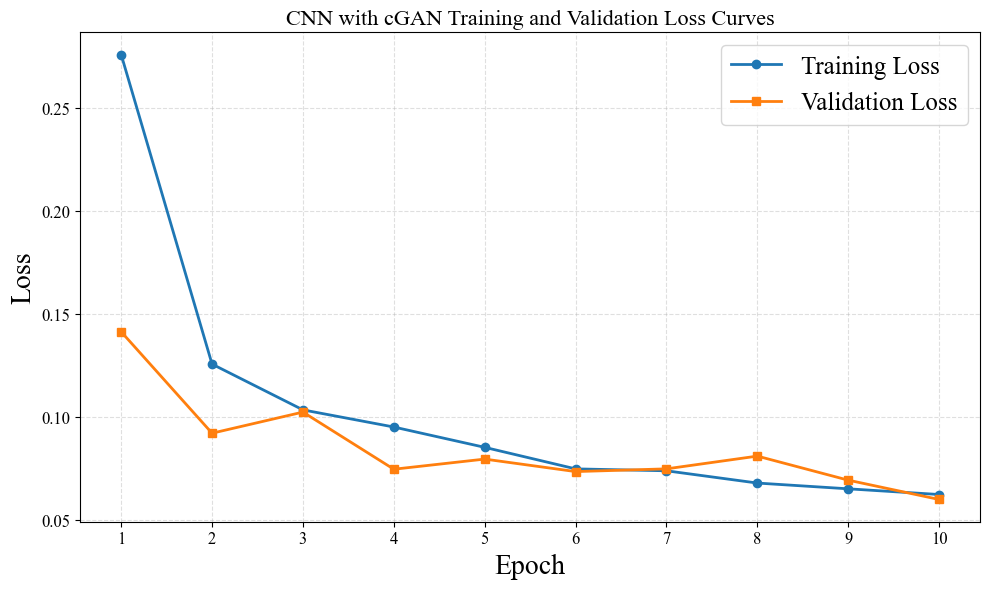
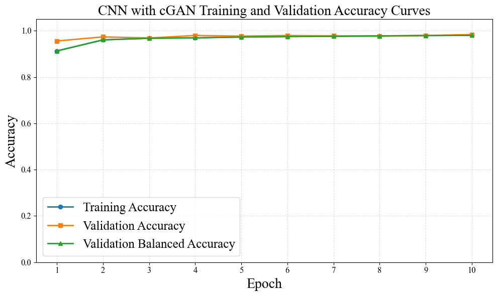
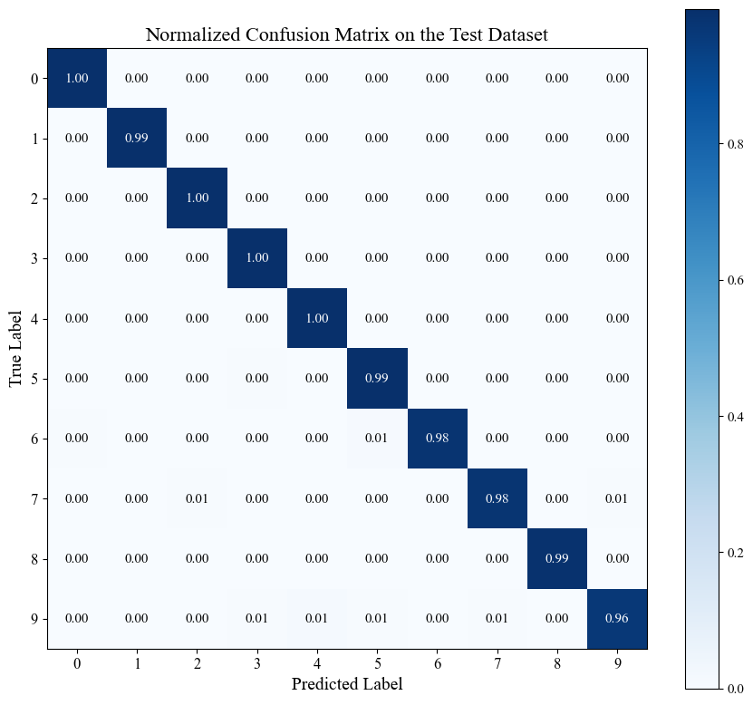

# FIT-Senior-Data-Scientist-Task1

## 1. Experiment Goal

This experiment examines whether Conditional GAN augmentation can reduce the negative effect of class imbalance on MNIST classification. Two CNN models are compared:

- **Baseline CNN:** trained using the simulated imbalanced training dataset.
- **GAN-Augmented CNN:** trained using the same real samples plus class-conditioned synthetic samples generated for the underrepresented classes.

The discussion focuses on data imbalance, convergence behavior, final test performance, minority-class recall, and the limitations of interpreting a single experimental run.

## 2. Severity of the Simulated Class Imbalance

The original training split was intentionally reduced using progressively smaller retention ratios from class 2 to class 9.

| Class | Retention ratio | Real training samples |
|---:|---:|---:|
| 0 | 100% | 5,331 |
| 1 | 100% | 6,068 |
| 2 | 80% | 4,290 |
| 3 | 80% | 4,414 |
| 4 | 60% | 3,155 |
| 5 | 60% | 2,927 |
| 6 | 40% | 2,130 |
| 7 | 30% | 1,691 |
| 8 | 20% | 1,053 |
| 9 | 10% | 535 |
| **Total** | — | **31,594** |

Class 1 contained 6,068 samples, whereas class 9 contained only 535. The largest-to-smallest class ratio was therefore approximately **11.34:1**. This imbalance was sufficiently large to affect the model's early class-balanced learning, even though MNIST remained a relatively easy classification problem.

## 3. Baseline CNN Performance under Imbalance

The baseline CNN achieved strong aggregate test performance:

| Metric | Baseline CNN |
|---|---:|
| Test loss | 0.0395 |
| Accuracy | 0.9868 |
| Balanced accuracy | 0.9868 |
| Macro precision | 0.9868 |
| Macro recall | 0.9868 |
| Macro F1-score | 0.9867 |
| Misclassified samples | 132 of 10,000 |

The high aggregate accuracy shows that the simulated imbalance did not cause a large collapse in MNIST performance. However, the class-level result reveals a clear weakness in the most severely underrepresented class.

Class 9 had only 535 real training samples and achieved a recall of approximately **0.93**, which was substantially lower than the recalls of most other classes. Its errors were distributed mainly across visually similar digits such as 3, 4, 5, 7, and 8. This result indicates that aggregate accuracy alone can hide minority-class degradation.

## 4. GAN-Based Data Augmentation

The Conditional GAN generated enough samples to increase every class to the largest real class size of 6,068 samples.

| Class | Real samples | Generated samples | Final samples | Synthetic share |
|---:|---:|---:|---:|---:|
| 0 | 5,331 | 737 | 6,068 | 12.1% |
| 1 | 6,068 | 0 | 6,068 | 0.0% |
| 2 | 4,290 | 1,778 | 6,068 | 29.3% |
| 3 | 4,414 | 1,654 | 6,068 | 27.3% |
| 4 | 3,155 | 2,913 | 6,068 | 48.0% |
| 5 | 2,927 | 3,141 | 6,068 | 51.8% |
| 6 | 2,130 | 3,938 | 6,068 | 64.9% |
| 7 | 1,691 | 4,377 | 6,068 | 72.1% |
| 8 | 1,053 | 5,015 | 6,068 | 82.6% |
| 9 | 535 | 5,533 | 6,068 | 91.2% |
| **Total** | **31,594** | **29,086** | **60,680** | **47.9%** |

The final training dataset was perfectly balanced and increased from 31,594 to 60,680 samples. However, almost half of the final data were synthetic. Class 9 was particularly dependent on generated samples: 91.2% of its final training data came from the GAN. This high synthetic proportion is important when interpreting both the improvement and the potential risk of distribution mismatch.

## 5. GAN Training Behavior

The generator loss decreased rapidly from 2.2071 at epoch 1 to approximately 0.81 around epochs 20–30. During the same period, generated images became more recognizable. Later in training, the discriminator loss gradually decreased and the generator loss increased to 1.4145 by epoch 100, indicating that the discriminator regained an advantage.

This pattern does not necessarily mean that the final generator became worse. GAN losses reflect the competition between two models and are not direct image-quality metrics. Visual inspection shows that the generated digits at epoch 100 were generally clearer and more class-consistent than those at epoch 10.

Nevertheless, one displayed image per class is insufficient to prove diversity or rule out mode collapse. A larger generated-image sample and an independent quality measure would be required for a stronger conclusion.

## 6. Training Convergence Analysis

GAN augmentation produced a clear improvement in the **training-stage class-balanced convergence**.

### First-Epoch Comparison

| Measure | Baseline CNN | GAN-Augmented CNN | Change |
|---|---:|---:|---:|
| Training loss | 0.3359 | 0.2762 | **17.8% lower** |
| Training accuracy | 0.8972 | 0.9131 | **+1.59 percentage points** |
| Training balanced accuracy | 0.8324 | 0.9131 | **+8.07 percentage points** |

The baseline model's first-epoch accuracy was 0.8972, but its balanced accuracy was only 0.8324. The 6.48-percentage-point gap indicates that the model initially learned majority classes more effectively than minority classes.

After GAN balancing, training accuracy and balanced accuracy were both 0.9131 in the first epoch. This equality is expected because every class contained the same number of samples, and it shows that the model learned the classes more evenly from the beginning.

The GAN-Augmented CNN exceeded 0.96 training balanced accuracy by epoch 2. The baseline CNN did not exceed the same level until epoch 6. Similarly, the augmented model reached approximately 0.9695 balanced accuracy by epoch 4, whereas the baseline required approximately eight epochs to reach a comparable value. Therefore, GAN augmentation approximately halved the number of epochs required to reach this level of class-balanced training performance.

### Validation Convergence

The validation behavior was more complex. The baseline CNN achieved 0.9793 validation accuracy by epoch 3 and reached its highest value of 0.9887 at epoch 7. The GAN-Augmented CNN achieved 0.9692 at epoch 3 and reached 0.9838 at epoch 10.

Therefore, it would be inaccurate to state that GAN augmentation made validation accuracy converge faster. The stronger conclusion is:

> GAN augmentation accelerated balanced learning on the training dataset, but it did not provide a faster or consistently higher validation curve.

The difference may be related to the much larger training dataset and the domain difference between synthetic training images and real validation images.

## 7. Final Test Performance

| Metric | Baseline CNN | GAN-Augmented CNN | Absolute change |
|---|---:|---:|---:|
| Test loss | 0.0395 | **0.0334** | -0.0061 |
| Accuracy | 0.9868 | **0.9886** | +0.0018 |
| Balanced accuracy | 0.9868 | **0.9886** | +0.0018 |
| Macro precision | 0.9868 | **0.9885** | +0.0017 |
| Macro recall | 0.9868 | **0.9886** | +0.0018 |
| Macro F1-score | 0.9867 | **0.9885** | +0.0018 |
| Misclassified samples | 132 | **114** | -18 |

The GAN-Augmented CNN improved test accuracy by **0.18 percentage points**. Although this absolute improvement was small, the baseline was already close to 99%, leaving limited room for further improvement.

A more interpretable comparison is the number of errors. The baseline model misclassified 132 test samples, whereas the GAN-Augmented CNN misclassified 114. GAN augmentation therefore eliminated **18 errors**, corresponding to a **13.6% reduction in the total number of test errors**.

Test loss decreased from 0.0395 to 0.0334, which is a **15.4% relative reduction**. The lower loss suggests that the augmented model was not only slightly more accurate but also produced better-calibrated or more confident correct predictions on average.

## 8. Minority-Class Effect

The clearest class-level improvement occurred for class 9:

| Class | Real training samples | Baseline recall | GAN-Augmented recall | Change |
|---:|---:|---:|---:|---:|
| 9 | 535 | 0.93 | 0.96 | **+3 percentage points** |

Class 9's error rate decreased from approximately 7% to 4%. This corresponds to an approximate **42.9% relative reduction in its class-specific error rate**. Since class 9 was the smallest class in the original training dataset, this improvement supports the hypothesis that class-conditioned synthetic data can improve recognition of a severely underrepresented class.

The normalized confusion matrices also show that class 9 was less frequently confused with classes 5 and 8 after augmentation. However, the benefit was not uniform across all classes. For example, class 7 recall changed from approximately 0.99 to 0.98. GAN augmentation therefore redistributed class-level performance rather than improving every class simultaneously.

## 9. Main Data-Driven Findings

1. The 11.34:1 training imbalance mainly affected the early balanced learning behavior and the recall of class 9.
2. GAN augmentation increased the training dataset by 92.1%, from 31,594 to 60,680 samples.
3. The augmented model reduced first-epoch training loss by 17.8%.
4. First-epoch training balanced accuracy increased by 8.07 percentage points.
5. The augmented CNN reached 0.96 training balanced accuracy four epochs earlier than the baseline.
6. GAN augmentation did not improve validation convergence speed.
7. Final test accuracy increased from 98.68% to 98.86%.
8. The number of test errors decreased by 13.6%.
9. Test loss decreased by 15.4%.
10. Class 9 recall increased from 0.93 to 0.96, reducing its class-specific error rate by approximately 42.9%.

## 10. Interpretation and Limitations

The results support GAN augmentation primarily as a method for improving **balanced class learning and minority-class recognition**, rather than as a method for producing a large increase in aggregate accuracy.

The result should still be interpreted cautiously:

- Only one random seed was evaluated.
- The 0.18-percentage-point accuracy gain may fall within run-to-run variation.
- Nearly 48% of the final training data were synthetic.
- Class 9 contained more than ten times as many generated samples as real samples.
- Visual inspection alone cannot fully evaluate synthetic-data quality or diversity.
- The baseline achieved a higher peak validation accuracy even though the augmented model achieved better final test results.

Repeated experiments with identical seeds across methods are needed to determine whether the improvement is statistically reliable. Reporting the mean, standard deviation, and a paired significance test across multiple runs would provide stronger evidence.

## 11. Conclusion

The Conditional GAN successfully transformed a strongly imbalanced training dataset into a class-balanced dataset. This change made the CNN learn all classes more evenly during the early training epochs and improved recognition of the most underrepresented class.

The final improvement was modest in aggregate accuracy but meaningful in error-based terms: the augmented model reduced the total test error count by 13.6%, reduced test loss by 15.4%, and improved class 9 recall by three percentage points. These findings suggest that the main value of GAN augmentation was not simply increasing the dataset size, but reducing minority-class weakness while preserving strong performance across the remaining classes.
